# GitHub pages with Bioschemas markup

These GitHub pages include a page describing a [software](./software.md) and a page describing a [dataset](./dataset.md) that was created as an output from the software at hand.

## Overview
* __Name:__ Tutorial on adding Bioschemas markup to GitHub pages
* __Description:__ This tutorial shows how to add Bioschemas markup to GitHub pages. It uses a simple GitHub page hosted in the gh-pages branch to create a sample project page, i.e., as learners could do with their own GitHub projects. As an example, it uses the software and data corresponding to the released project [TREC-doc-2-doc-relevance](https://github.com/zbmed-semtec/TREC-doc-2-doc-relevance), a web-based interface to add document-to-document relevance assessments to pairs of documents retrieved from [TREC 2005 Genomics Track](https://trec.nist.gov/data/genomics/05/genomics.qrels.large.txt). 
* __Keywords:__ Bioschemas, schema.org, structured markup, GitHub pages

 __Questions__
* How can I add Bioschemas markup to GitHub pages?
* Can I also use schema.org types not included in Bioschemas?
* How can I use Bioschemas profiles? In particular [ComputationalTool](https://bioschemas.org/profiles/ComputationalTool/1.0-RELEASE) and [Dataset](https://bioschemas.org/profiles/Dataset/1.1-DRAFT) (bonus, we also use [TrainingMaterial](https://bioschemas.org/profiles/TrainingMaterial/1.0-RELEASE) to describe the tutorial itself)

 __Learning outcomes__
* Describe how schema.org and Bioschemas markup can be embedded to GitHub pages
* Use schema.org and Bioschemas profiles on GitHub pages
* Use schema and Bioschemas validators

 __Requirements__
* Understanding of what is Bioschemas and what are Bioschemas types and profiles
* Familiarity on how to use GitHub 
* Basic knowledge on how to use GitHub pages. More information at [GitHub Pages](https://pages.github.com/)
* Familiarity with JSON-LD
* Basic knowledge on Markdown
* Knowledge of develop tools on a browser

 __Time estimation__ 30 minutes

 __Level__ Beginner / Introductory

 __Published__ 2024-02-05

 __Latest modification__ 2024-09-20

 __License__ [CC-By 4.0](https://spdx.org/licenses/CC-BY-4.0)

 __Version__ 1.1.1

 __Identifier__ [DOI:10.5281/zenodo.13799121](https://doi.org/10.5281/zenodo.13799121)

 __Citation__ Castro, LJ. (2024). Adding Bioschemas Dataset and ComputationalTool markup to GitHub pages. Zenodo. https://doi.org/10.5281/zenodo.13799121

## Learning experience

### Agenda
In this tutorial we will cover:
- [GitHub pages with Bioschemas markup](#github-pages-with-bioschemas-markup)
  - [Overview](#overview)
  - [Learning experience](#learning-experience)
    - [Agenda](#agenda)
    - [Creating this GitHub Page](#creating-this-github-page)
    - [Adding schema.org and Bioschemas markup](#adding-schemaorg-and-bioschemas-markup)
      - [Using schema.org types](#using-schemaorg-types)
      - [Using Bioschemas profiles](#using-bioschemas-profiles)
    - [Visualizing the structured markup](#visualizing-the-structured-markup)
    - [Validating the pages against the Schema Validator](#validating-the-pages-against-the-schema-validator)
    - [Validating the pages against the Rich Results Test](#validating-the-pages-against-the-rich-results-test)
    - [Validating the pages against FAIR-Checker/Bioschemas validator](#validating-the-pages-against-fair-checkerbioschemas-validator)
    - [Creating a Sitemap](#creating-a-sitemap)
    - [Try it out](#try-it-out)
  - [What is next?](#what-is-next)
  - [Acknowledgements](#acknowledgements)

### Creating this GitHub Page
Let's start by forking [this repository](https://github.com/zbmed-semtec/bioschemas-ghpages-markup-tutorial) for your own purposes. Once forked, go to settings


You will need to enable "Pages" on your forked repository, and select under Source `Deploy from a branch`. Use the `main` branch and the folder `/docs`. `Save` your changes.

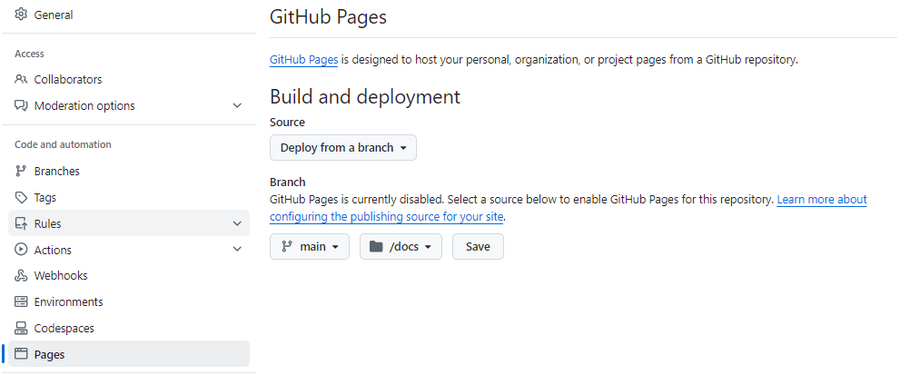

In a matter of minutes, your site will be live. The pages corresponding to the examples used in this tutorial are available at [https://zbmed-semtec.github.io/bioschemas-ghpages-markup-tutorial/](https://zbmed-semtec.github.io/bioschemas-ghpages-markup-tutorial/). They will have no markup to start with, you will add it in a moment.

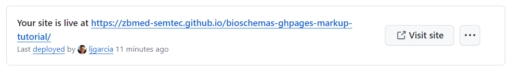

Do not forget to get a local copy of your fork so you can make changes.

### Adding schema.org and Bioschemas markup
We will add schema.org and Bioschemas markup corresponding to our example, code (software page) and data (dataset page) for our repo [TREC-doc-2-doc-relevance](https://github.com/zbmed-semtec/TREC-doc-2-doc-relevance). Right now those pages only have text, with the following steps you will get schema.org/Bioschemas markup embedded in your pages. 

With GitHub pages, same a with regular HTML (static or generated), the trick is adding the JSON-LD describing those elements that you want. To do so, you need to add a block `<script type="application/ld+json">` with the Bioschemas markup as a JSON-LD inside the block.

The Bioschemas markup will start with the context `"@context": "https://schema.org"`, i.e., where all types and profiles are defined.

Then you add the type and id of what you are describing, for instace a `bioschemas:ComputationalTool`. The `"http://purl.org/dc/terms/conformsTo"` is the bit that indicates that you are using Bioschemas.

```
  "@type": "SoftwareApplication",
  "@id": "https://doi.org/10.5281/zenodo.7341391",
  "http://purl.org/dc/terms/conformsTo": "https://bioschemas.org/profiles/ComputationalTool/1.0-RELEASE",
```

For the rest of the markup, you need to see what the Bioschemas profile recommends ([keep reading, more information below](#using-bioschemas-profiles)).

To get the markup added to your pages, copy the content of [software](./software.md) to the [software page under /docs folder](./docs/software.md). Then copy the content of [dataset](./dataset.md) to the [dataset page under /docs folder](./docs/dataset.md)

Have a look to the pages that you just created on your own GitHub pages, one for the [code and corresponding release](https://zbmed-semtec.github.io/bioschemas-ghpages-markup-tutorial/software), another for a [dataset created from data collected by the software](https://zbmed-semtec.github.io/bioschemas-ghpages-markup-tutorial/dataset). To see them working for your repo (that will now have the schemas.org/Bioschemas markup), you need to use `<your_user>/<your_repo>` instead of `zbmed-semtec.github.io/bioschemas-ghpages-markup-tutorial` on the html link `https://zbmed-semtec.github.io/bioschemas-ghpages-markup-tutorial/dataset`.

The [software page](https://zbmed-semtec.github.io/bioschemas-ghpages-markup-tutorial/software) in your repo should now have markup for two elements, `schema:SoftareSourceCode` and `bioschemas:ComputationalTool`. 

The markup corresponding to `schema:SoftwareSourceCode` is shown below. Note that the _source code_ is linked to the _release_ via the property `schema:targetProduct`. In the code below, we are using the _release_ `@id` to refer to it.

```
<script type="application/ld+json">
  { 
    "@context": "https://schema.org", 
    "@type": "SoftwareSourceCode",
    "@id": "https://github.com/zbmed-semtec/TREC-doc-2-doc-relevance",
    "citation": "Talha M, Geist L, Fellerhof T, Ravinder R, Giraldo O, Rebholz-Schuhmann D, et al. TREC-doc-2-doc-relevance [Software source code]. GitHub; 2022.",
    "name": "TREC-doc-2-doc-relevance",
    "description": "This is the software source code facilitating the creation of a doc-2-doc relevance assessment on PMIDs used in the TREC 2005 Genomics track along with its metadata.",
    "url": "https://github.com/zbmed-semtec/TREC-doc-2-doc-relevance#",
    "targetProduct": { 
      "@id": "https://doi.org/10.5281/zenodo.7341391"
    },
    "license": {
      "@type": "CreativeWork",
      "@id": "http://spdx.org/licenses/MIT",
      "name": "MIT License", 
      "url": "https://opensource.org/license/mit/"
    },
    "author": [
      {"@id": "https://zbmed-semtec.github.io/previous_members/#muhammad-talha"},
      {"@id": "https://orcid.org/0000-0002-2910-7982"},
      {"@id": "https://orcid.org/0000-0002-8725-1317"},
      {"@id": "https://orcid.org/0009-0004-4484-6283"},
      {"@id": "https://orcid.org/0000-0003-2978-8922"},
      {"@id": "https://orcid.org/0000-0002-1018-0370"},
      {"@id": "https://orcid.org/0000-0003-3986-0510"}
    ]
  }
<7script>
```

Note that we use a trick for the `@id` and the `schema:url` in our markup. Identifiers should be unique, global and permanent, like e.g., DOIs, and clearly identify the object they describe (in this case a source code). But, we do not have such a PID for our source code, we only have the GitHub URL for our repo. Now, if the `@id` is meant to identify a source code, we cannot use the exact same URL for the source code and for a "regular" url. We add `#` to the "regular" URL. If we do not, validators will see that the exact same URL is used to identify a source code and a "regular" URL but source codes and URLs are not the same thing so the validators might get confused. Using the exact same URL would be like saying that an animal is a cat at the same time that it is a dog, it cannot be. The best way to go would be getting an actual PID for your repo, e.g., via w3id.org

And here you have the markup corresponding to the `bioschemas:ComputationalTool`

```
<script type="application/ld+json">
  { 
    "@context": "https://schema.org", 
    "@type": "SoftwareApplication",
    "@id": "https://doi.org/10.5281/zenodo.7341391",
    "http://purl.org/dc/terms/conformsTo": "https://bioschemas.org/profiles/ComputationalTool/1.0-RELEASE",
    "identifier": "DOI:10.5281/zenodo.7341391",
    "citation": "Talha M, Geist L, Fellerhof T, Ravinder R, Giraldo O, Rebholz-Schuhmann D, et al. TREC-doc-2-doc-relevance assessment interface. Zenodo; 2022. doi:10.5281/zenodo.7341391",
    "name": "TREC-doc-2-doc-relevance assessment interface",
    "description": "The code, data and docs at this release aim at facilitating the creation of a doc-2-doc relevance assessment on PMIDs used in the TREC 2005 Genomics track. A doc-2-doc relevance assessment takes one document as reference and assess a second document regarding its relevance to the reference one. This doc-2-doc collection will be used to evaluate the doc-2-doc recommendations approaches that we are working on.",
    "url": "https://zenodo.org/records/7341391",
    "softwareVersion": "1.0.0",
    "datePublished": "2022-11-21",
    "license": {
      "@type": "CreativeWork",
      "@id": "http://spdx.org/licenses/MIT",
      "name": "MIT License", 
      "url": "https://opensource.org/license/mit/"
    },
    "author": [
      {"@id": "https://zbmed-semtec.github.io/previous_members/#muhammad-talha"},
      {"@id": "https://orcid.org/0000-0002-2910-7982"},
      {"@id": "https://orcid.org/0000-0002-8725-1317"},
      {"@id": "https://orcid.org/0009-0004-4484-6283"},
      {"@id": "https://orcid.org/0000-0003-2978-8922"},
      {"@id": "https://orcid.org/0000-0002-1018-0370"},
      {"@id": "https://orcid.org/0000-0003-3986-0510"}
    ]
  }
</script>
```

The [dataset page](https://zbmed-semtec.github.io/bioschemas-ghpages-markup-tutorial/dataset) in your repo should now have markup only for one element, a dataset.

```
<script type="application/ld+json">
  
  {
    "@context": "https://schema.org", 
    "@type": "Dataset",
    "@id": "https://doi.org/10.5281/zenodo.7338056",
    "conformsTo": "https://bioschemas.org/profiles/Dataset/1.1-DRAFT", 
    "identifier": "DOI:10.5281/zenodo.7338056",
    "citation": "Giraldo O, Solanki D, Rebholz-Schuhmann D, Castro LJ. Fleiss kappa for doc-2-doc relevance assessment. Zenodo; 2022. doi:10.5281/zenodo.7338056",
    "name": "Fleiss kappa for doc-2-doc relevance assessment",
    "description": "Fleiss' kappa measuring inter-annotator agreement on a document-to-document relevance assessment task. The table contains 7 columns, the first one presents the topics, 8 in total. The second column shows the \"reference articles\", represented by their PubMed-ID and organized by topic. The third column shows the Fleiss’ Kappa results. The fourth column shows the interpretation of the Fleiss' Kappa results being: i) \"Poor\" results <0.20, ii) \"Fair\" results within 0.21 - 0.40, and iii) \"Moderate\" results within 0.41 - 0.60. The fifth column shows the PubMed-IDs of evaluation articles rated by the four annotators as \"Relevant\" regarding its corresponding \"reference article\". The sixth column shows the PubMed-IDs of evaluation articles rated by the four annotators as \"Partially relevant\" regarding its corresponding \"reference article\". The seventh column shows the PubMed-IDs of evaluation articles rated by the four annotators as \"Non-relevant\" regarding its corresponding \"reference article\".",
    "keywords": "Fleiss' Kappa, Inter-annoator agreement, TREC Genomics Track 2005, relevance assessment", 
    "license": {
      "@type": "CreativeWork",
      "@id": "http://spdx.org/licenses/CC-BY-4.0",
      "name": "Creative Commons Attribution 4.0 International", 
      "alternateName": "CC BY 4.0",
      "url": "https://creativecommons.org/licenses/by/4.0/"
    },
    "url": "https://zenodo.org/record/7338056",
    "datePublished": "2022-11-19",
    "author": [                
      {"@id": "https://orcid.org/0000-0003-2978-8922"},
      {"@id": "https://orcid.org/0009-0004-1529-0095"},
      {"@id": "https://orcid.org/0000-0002-1018-0370"},
      {"@id": "https://orcid.org/0000-0003-3986-0510"}
    ]
  }
</script>
```

#### Using schema.org types
If you use a schema.org type that has a corresponding Bioschemas profile, we recommend using the Bioschemas profile as it will help you focus on the most common and useful properties. However, if there is a type in schema.org that does not have a Bioschemas profile, we suggest finding examples on how others have used them for a case similar to yours.

In this case we have used `schema:SoftwareSourceCode` with some properties that are also present for `bioschemas:ComputationalTool` and that will provide some minimum information to anyone willing to reuse our source code, including citation information.

#### Using Bioschemas profiles
Whenever you use a Bioschemas profile, go to the corresponding page, we have used:
* [bioschemas:ComputationalTool](https://bioschemas.org/profiles/ComputationalTool/1.0-RELEASE), and
* [bioschemas:Dataset](https://bioschemas.org/profiles/Dataset/1.0-RELEASE)

The minimum information that you should provide are the "minimum" properties, and, whenever possible, it is a good idea to also provide the "recommended" ones. Optional properties are up to you. Another important piece of information is the cardinality, whether or not you could use a single _object_ or an _array_.

You can find examples and other useful links for each Bioschemas profile

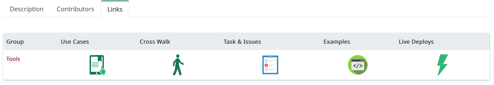

And also [live deploys](https://bioschemas.org/developer/liveDeploys#nav-profile) using the profile

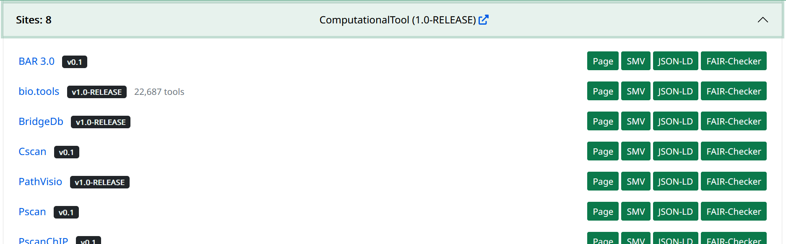

If you use Bioschemas markup on your website, you can also add it to the "live deploy" list. TODO

### Visualizing the structured markup

Once the markup is in place and the page is live, you can use the developers tools in a browser to visualize the markup. You can use the `inspect` tool in e.g., Chrome, Firefox or Edge. 

Go to the [software page](https://zbmed-semtec.github.io/bioschemas-ghpages-markup-tutorial/software.html) and use the `inspect` tool for any element. You should see the HTML.

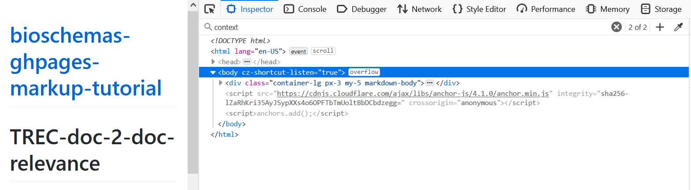

With `CTRL+F`(or `command key + F` on Macs) to search and find `context`. The first one is added by GitHub pages, and describes the page as a `schema:WebPage`.

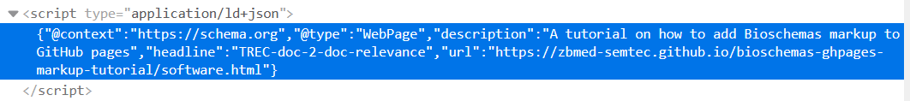

The second occurence will be the markup corresponding to the `schema:SoftwareSourceCode` and `bioschemas:ComputationalTool` manually added to the block `<script type="application/ld+json">`.


If you look closely, you will notice that we have the elementt `bioschemas:ComputationalTool` fully inside the element `schema:SoftwareSourceCode` rather than a reference via the `"@id": "https://doi.org/10.5281/zenodo.7341391"` as we did above. Both ways are valid.

This is how we have embedded the Bioschemas markup on the page
```
<script type="application/ld+json">
  { 
    "@context": "https://schema.org", 
    "@type": "SoftwareSourceCode",
    "@id": "https://github.com/zbmed-semtec/TREC-doc-2-doc-relevance",
    "citation": "Talha M, Geist L, Fellerhof T, Ravinder R, Giraldo O, Rebholz-Schuhmann D, et al. TREC-doc-2-doc-relevance [Software source code]. GitHub; 2022.",
    "name": "TREC-doc-2-doc-relevance",
    "description": "This is the software source code facilitating the creation of a doc-2-doc relevance assessment on PMIDs used in the TREC 2005 Genomics track along with its metadata.",
    "url": "https://github.com/zbmed-semtec/TREC-doc-2-doc-relevance#",
    "targetProduct": { 
      "@type": "SoftwareApplication",
      "@id": "https://doi.org/10.5281/zenodo.7341391",
      "http://purl.org/dc/terms/conformsTo": "https://bioschemas.org/profiles/ComputationalTool/1.0-RELEASE",
      "identifier": "DOI:10.5281/zenodo.7341391",
      "citation": "Talha M, Geist L, Fellerhof T, Ravinder R, Giraldo O, Rebholz-Schuhmann D, et al. TREC-doc-2-doc-relevance assessment interface. Zenodo; 2022. doi:10.5281/zenodo.7341391",
      "name": "TREC-doc-2-doc-relevance assessment interface",
      "description": "The code, data and docs at this release aim at facilitating the creation of a doc-2-doc relevance assessment on PMIDs used in the TREC 2005 Genomics track. A doc-2-doc relevance assessment takes one document as reference and assess a second document regarding its relevance to the reference one. This doc-2-doc collection will be used to evaluate the doc-2-doc recommendations approaches that we are working on.",
      "url": "https://zenodo.org/records/7341391",
      "softwareVersion": "1.0.0",
      "datePublished": "2022-11-21",
      "license": {
        "@type": "CreativeWork",
        "@id": "http://spdx.org/licenses/MIT",
        "name": "MIT License", 
        "url": "https://opensource.org/license/mit/"
      },
      "author": [
        {"@id": "https://zbmed-semtec.github.io/previous_members/#muhammad-talha"},
        {"@id": "https://orcid.org/0000-0002-2910-7982"},
        {"@id": "https://orcid.org/0000-0002-8725-1317"},
        {"@id": "https://orcid.org/0009-0004-4484-6283"},
        {"@id": "https://orcid.org/0000-0003-2978-8922"},
        {"@id": "https://orcid.org/0000-0002-1018-0370"},
        {"@id": "https://orcid.org/0000-0003-3986-0510"}
      ]
    },
    "license": {
      "@type": "CreativeWork",
      "@id": "http://spdx.org/licenses/MIT",
      "name": "MIT License", 
      "url": "https://opensource.org/license/mit/"
    },
    "author": [
      {"@id": "https://zbmed-semtec.github.io/previous_members/#muhammad-talha"},
      {"@id": "https://orcid.org/0000-0002-2910-7982"},
      {"@id": "https://orcid.org/0000-0002-8725-1317"},
      {"@id": "https://orcid.org/0009-0004-4484-6283"},
      {"@id": "https://orcid.org/0000-0003-2978-8922"},
      {"@id": "https://orcid.org/0000-0002-1018-0370"},
      {"@id": "https://orcid.org/0000-0003-3986-0510"}
    ]
  }
</script>
```

### Validating the pages against the Schema Validator

Go to [Schema validator](https://validator.schema.org/). Add the URL for either the [software page](https://zbmed-semtec.github.io/bioschemas-ghpages-markup-tutorial/software.html) or the [dataset page](https://zbmed-semtec.github.io/bioschemas-ghpages-markup-tutorial/dataset.html) and click on "Run Test"

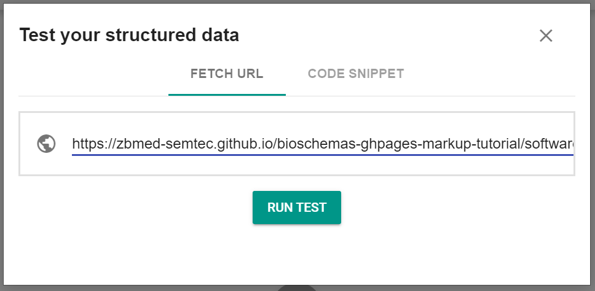

In the case of the [software page](https://zbmed-semtec.github.io/bioschemas-ghpages-markup-tutorial/software.html), it identifies and validates the two upper objects corresponding to `schema:WebPage` and `schema:SoftwareSourceCode` but it does not find `bioschemas:ComputationalTool` (which corresponds to a `schema:SoftwareApplication`)

You can run the test again with a "Code Snippet" by copying and pasting the code embedded on the page, the results will be the same. However, if you try and validate a code snippet containing only one element, the inner element `bioschemas:ComputationalTool`, the Schema Validator will identify and validate it (tested on 2024-02-05).

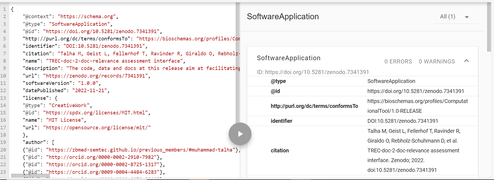

### Validating the pages against the Rich Results Test
There is another schema.org validator, currently the one recommended by Google. Go to [Rich Results Test](https://search.google.com/test/rich-results) and use the same URL as before, and click "Test URL".

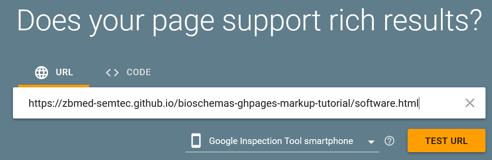

If you try the [software page](https://zbmed-semtec.github.io/bioschemas-ghpages-markup-tutorial/software.html), it will identify some errors with `schema:SoftwareApplication`. Yes, it does identify the inner element! As there is an error, only the error will be shown, nothing regarding the other elements. It looks like our `bioschemas:ComputationalTool` is missing some important elements (for Google, and you will see also for Bioschemas).

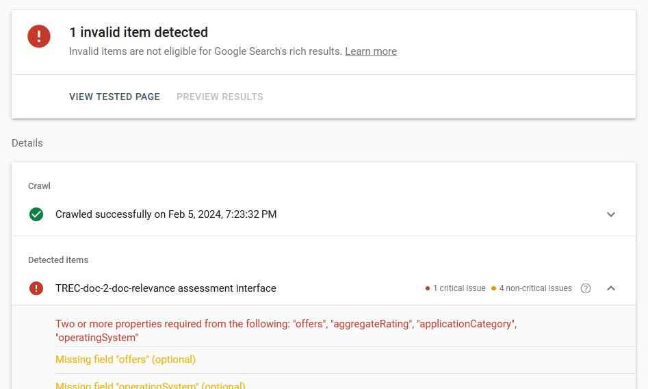

If you try the [dataset page](https://zbmed-semtec.github.io/bioschemas-ghpages-markup-tutorial/dataset.html), one correct element will be identified. 

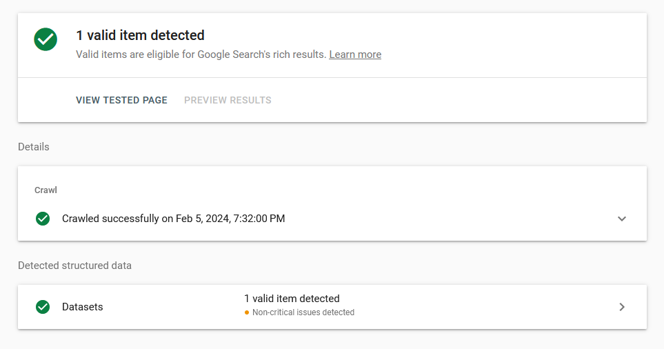

Did you notice that nor the Schema Validator neither the Rich Results Test pay attention to the `schema:WebPage` element?

### Validating the pages against FAIR-Checker/Bioschemas validator
Let's try now a validator specific for Bioschemas. Go to [FAIR-Checker](https://fair-checker.france-bioinformatique.fr/) and click on the blue button "Inspect". 

On Step 1, add the URL for either the [software page](https://zbmed-semtec.github.io/bioschemas-ghpages-markup-tutorial/software.html) or the [dataset page](https://zbmed-semtec.github.io/bioschemas-ghpages-markup-tutorial/dataset.html) and click on "Build Knowledge Graph"

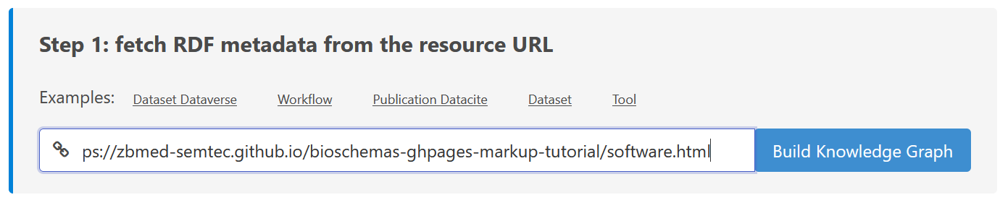

Once you can see that the Knowledge Graph is ready in Step 2


__Jump directly to step 3__, select "Bioschemas" and click "Check Bioschemas"

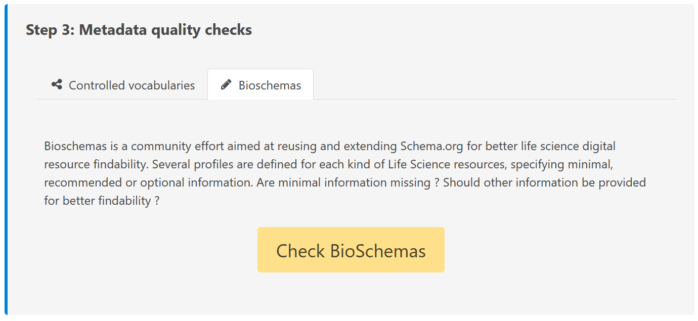


Only Bioschemas profiles will be checked so, in this case `bioschemas:ComputationalTool` and `bioschemas:Dataset` but not `schema:SoftwareSourceCode`.

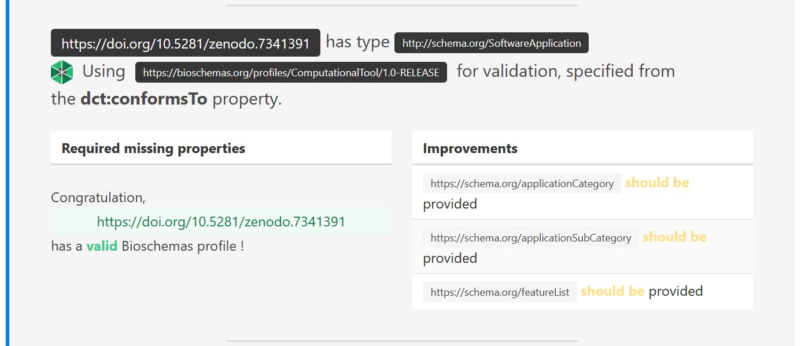

We are missing some of the _recommended_ properties and the validator indicates this as _improvements_.

### Creating a Sitemap
If you want to make it easier for machines to crawl your website (and this could be a good idea when you have markup and you want to enable easy integration into aggregators), consider adding a sitemap.xml to your website.

We have used [XML-Sitemaps](https://www.xml-sitemaps.com/) to create [the one for the GitHub pages used in this tutorial](https://zbmed-semtec.github.io/bioschemas-ghpages-markup-tutorial/sitemap.xml). 

Our sitemap looks like

```
<?xml version="1.0" encoding="UTF-8"?>
<urlset
      xmlns="http://www.sitemaps.org/schemas/sitemap/0.9"
      xmlns:xsi="http://www.w3.org/2001/XMLSchema-instance"
      xsi:schemaLocation="http://www.sitemaps.org/schemas/sitemap/0.9
            http://www.sitemaps.org/schemas/sitemap/0.9/sitemap.xsd">
<!-- created with Free Online Sitemap Generator www.xml-sitemaps.com -->
  <url>
    <loc>https://zbmed-semtec.github.io/bioschemas-ghpages-markup-tutorial/</loc>
    <lastmod>2024-02-05T14:31:07+00:00</lastmod>
    <priority>1.00</priority>
  </url>
  <url>
    <loc>https://zbmed-semtec.github.io/bioschemas-ghpages-markup-tutorial/software.html</loc>
    <lastmod>2024-02-05T14:31:07+00:00</lastmod>
    <priority>0.80</priority>
  </url>
  <url>
    <loc>https://zbmed-semtec.github.io/bioschemas-ghpages-markup-tutorial/dataset.html</loc>
    <lastmod>2024-02-05T14:31:07+00:00</lastmod>
    <priority>0.80</priority>
  </url>
</urlset>
```

### Try it out

Try and modify the markup to describe a source code of your own. If you have not created a release yet, use only `schema:SoftwareSourceCode`. If you have a release or if you prefer, you can omit the markup for the source code and use only `bioschemas:ComputationalTool` for your release. Or you can provide some markup describing a dataset you have created for this you would use `bioschemas:Dataset`. 

Are you interested in using Bioschemas markup for real on your web pages? [Join the community](https://bioschemas.org/community/howtojoin), you can send questions to the mailing list or more informally on the Slack channel.

## What is next?
We covered a manual addition of schema.org and Bioschemas markup to GitHub pages. However, websites many times are created by a production pipeline. In those cases, markup creation should be integrated to it. 

We also briefly mentioned sitemaps with much of a context. We invite to get more information on what they are and why they are useful.

## Acknowledgements
This tutorial is based on [bioschemas-github-markup-example](https://github.com/zbmed-semtec/bioschemas-github-markup-example) and [Adding schema.org to a GitHub Pages site](https://bioschemas.org/tutorials/howto/howto_add_github).

LJC has received fundings from the [German Research Foundation (DFG)](https://www.dfg.de/en) via the grant for NFDI4DataScience No. [460234259](https://gepris.dfg.de/gepris/projekt/460234259)

We use free SVG icons from [Font Awesone](https://fontawesome.com/)
